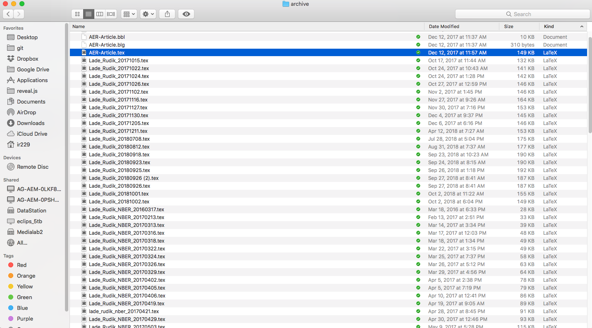
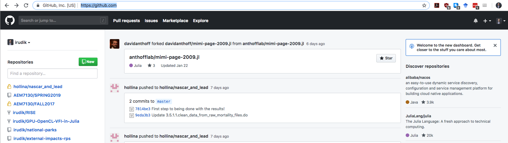

# Software and stuff

Necessary things to do:

- Install [Anaconda](https://www.anaconda.com/distribution/)

- Install [Julia](https://julialang.org/downloads/)

- Install [Git](https://git-scm.com/downloads)

- Create an account on [GitHub](https://github.com/) 

- Install [Sourcetree](https://www.Sourcetreeapp.com/) if you want a GUI for Git

- Accept invite to the AEM 7130 classroom repository on GitHub

--

Quick Note:

A decent chunk of these slides (and the entire class format!) is inspired by [Grant McDermott's data science course](https://github.com/uo-ec607/lectures)

If you're interested in more data science-y and less numerical/structural material, check his material out

---

# Why bother with this new fangled Git stuff?

The classic *date your file name method* is not good

<div align="center">
  
</div>

--

When did you make changes? Who made them? How do you undo only **some** changes from one update to the next?

--

If you've ever had a disaster managing code changes (you will), Git can help

---

# Git is the smart way to handle code

## What is git?

>> Git is a distributed version control system for tracking changes in source code during software development. It is designed for coordinating work among programmers, but it can be used to track changes in any set of files. Its goals include speed, data integrity, and support for distributed, non-linear workflows.

--
 
## Okay, so what?

--

Git combines a bunch of very useful features:

--

- Remote storage of code on a host like GitHub/GitLab/Bitbucket/etc, **just like Dropbox**

--

- Tracking of changes to files in a very clean way

--

- Easy ways to test out experimental changes (e.g. new specifications, additional model states) and not have them mess with your main code

--

- Built for versioning **code** like R, Julia, LaTeX, etc

---

# Git histories in Sourcetree

Some apps can give you a pretty visual of the history of changes to your code (shell can too, but not as nice)

<div align="center">
  
</div>

<div align="center">
  
</div>
---

# GitHub

## Git $\neq$ GitHub

--

## GitHub hosts a bunch of online services we want when using Git

--

- Allows for people to suggest code changes to existing code on the site

--

- It's the main location for non-base Julia packages (and **tons** of other stuff) to be stored and developed

--

- It has services that I used to set up this class, etc

--

## The differences:

--

- Git is the infrastructure for versioning and merging files

--

- GitHub provides an online service to coordinate working with Git repositories, and adds some additional features for managing projects

---

# Why Git and GitHub?

## Selfish reasons

--

The private benefits of having well-versioned code in case you need to go back to previous stages

--

Your directories will be super clean

--

It is MUCH easier to collaborate on projects

--

## Semi-altruistic reasons

--

The external benefits of open science, collaboration, etc

--

These external benefits also generate some downstream private reputational benefits (must be confident in your code to make it public) and can improve future social efficiency (commitment device to post future code)

--

My code for **everything** I've ever published is on [my GitHub](https://github.com/irudik) (I'll look real shady if I don't post code in the future)

--

Ideally yours will be too

---

# Git basics

Everything on Git is stored in something called a **repository** or *repo* for short

--

This is the directory for a project

--

- Local: a directory with a `.git` subdirectory that stores the history of changes to the repository
- Remote: a website, e.g. see the GitHub repo for the [Optim](https://github.com/JuliaNLSolvers/Optim.jl) package in Julia

<div align="center">
  
</div>

---

# Creating a new repo on GitHub

## Let's create a new repo

--

This is pretty easy from the GitHub website: just click on that green `new` button from the launch page
<div align="center">
  
</div>

---

# Creating a new repo on GitHub

Next steps:
1. Choose a name
2. Choose a description
3. Choose whether the repo is public or private
4. Choose whether you want to add a `README.md` (yes), or a `.gitignore` or a `LICENSE.md` file (more next slide) 
<div align="center">
  
</div>

---

# Git basics

Repos come with some common files in them

- `.gitignore`: lists files/directories/extensions that Git shouldnt track (raw data, restricted data, those weird LaTeX files)
- `README.md`: a Markdown file that is basically the welcome content on repo's GitHub website, you should generally initialize a repo with one of these
- `LICENSE.md`: describes the license agreement for the repository

<div align="center">
  
</div>

---

# Creating a new repo on GitHub

You can find the repo at [https://github.com/irudik/example-repo-7130](https://github.com/irudik/example-repo-7130)

<div align="center">
  
</div>


---

# How do I get a repo on GitHub onto on my computer?

## Clone

To get the repository on your local machine you need to **clone** the repo, you can do this in a few ways from the repo site

--

Key thing: this will **link** your local repository to the remote, you'll be able to update your local when the remote is changed

--

1. If you want to use the GitHub desktop app instead of command line, click on "Open in Desktop"
2. If you use another app (Sourcetree, etc) you can copy the URL for cloning
3. You can use command line `git clone https://github.com/irudik/example-repo-7130.git`

<div align="center">
  
</div>

---

# How do I get a repo on GitHub onto on my computer?

## Cloning in Sourcetree (might be different on Windows)

1. Click on `New` then `Clone from URL`
<div align="center">
  
</div>

---

# How do I get a repo on GitHub onto on my computer?

## Cloning in Sourcetree (might be different on Windows)


2a. Enter the URL `https://github.com/irudik/example-repo-7130.git` from GitHub  
2b. Enter a local (non-existing) directory to clone into  
2c. Pick a repo name  
<div align="center">
  
</div>

---

# How do I get a repo on GitHub onto on my computer?

## Cloning in Sourcetree (might be different on Windows)

You're done!
<div align="center">
  
</div>

---

# How do I get a repo on GitHub onto on my computer?

## Cloning in Sourcetree (might be different on Windows)

You're done! **Now create and clone your own repository, initialized with a `README.md`, and follow along.**
<div align="center">
  
</div>

---

# Using Git

There are only a few basic Git operations you need to know for versioning solo economics research efficiently

--

**Add/Stage:** This adds files to the index, in other words, it takes a snapshot of the changes you want updated/saved in your local repository (i.e. your computer)
  - `git add -A` Adds all files to the index

--

**Commit:** This records the changes to your local repository
  - `git commit -m "Updated some files"` Commits the changes added to the index with the commit message in quotations

--

**Push:** This sends the changes to the remote repository (i.e. GitHub)
  - `git push origin master` Pushes changes on your local repo to a **branch** called `master` on your remote, typically named `origin` (can often omit `origin master`)

--

**Pull:** This takes changes on the remote and integrates them with the local repository (technically two operations are going on: fetch and merge)
  - `git pull origin master` Integrates the changes on the `master` branch of your remote `origin` into your local repo (again, can often omit `origin master`)


---

# The flow of Git

<div align="center">
  
</div>
  
---

# Using Git

In your own repository do the following using either shell or Sourcetree:

--

1. Open `README.md` in some text editor and insert the following code: `# Hello World!`
2. Save `README.md`
3. Add the changes to `README.md` to the index
4. Commit the changes to your local repo with the message: "First README.md edit."
5. Push the changes to your remote

--

Did the changes show up your repo's GitHub page?

---

# Using Git

Some more (but not very) advanced operations are

--

**Branch:** This adds/deletes/merges different **branches** of your repository
  - `git branch` Lists all local branches
  - `git branch -a` Lists all remote branches
  - `git branch solar-panels` Creates a new branch called `solar-panels`
  - `git branch -d solar-panels` Deletes the local `solar-panels` branch

--

**Checkout:** This switches you between different commits or branches
  - `git checkout solar-panels` Switches you to branch `solar-panels`
  - `git checkout -b wind-turbines` Creates a new branch called `wind-turbines` and checks it out

--
 
**Merge:** This merges two separate histories together (e.g. merges a separate branch back into the master)
  - `git checkout master`  
  `git merge wind-turbines`  
  Checks out `master` and then merges `wind-turbines` back into the master

---

# Using Git

In your own repository do the following using either shell or Sourcetree:

--

1. Create and checkout a new branch called `test-branch`
2. Edit `README.md` and add the following code: `## your_name_here`
2. Save `README.md`
3. Add the changes to `README.md` to the index
4. Commit the changes to your local repo with the message: "Test change to README.md."
5. Merge the changes back into the `master` branch
6. Push the changes to your remote

--

Did the changes show up your repo's GitHub page?

---

# Teaming up

Find a partner for this next piece:

One of you invite the other to collaborate on the project (GitHub page $\rightarrow$ Settings $\rightarrow$ Collaborators)

<div align="center">
  
</div>

---

# Teaming up

If you were the one being invited, accept and clone the repo to your local

--

Now do the following:

1. Each of you edit the `# Hello World!` line of code to be something else and different from each other

--

2. Commit the changes to your local

--

3. Have one of you push your changes, and then have the other one push their changes

---

# Can't push changes when you aren't updated

### Shell
<div align="center">
  
</div>

### Sourcetree
<div align="center">
  
</div>

It turns out that the second person can't push their local changes to the remote: you need to be up to date before pushing

---

# Get up to date by pulling after you commit your local changes

You need to pull the remote changes first, but then you get the following message:

<div align="center">
  
</div>

And we got a `Merge conflict in README.md`

---

# Merge conflicts

Sometimes there will be conflicts between two separate histories
  - e.g. if you and your collaborator edited the same chunk of code separately on your local repos

--

When you try to merge these histories by pushing to the remote, Git will throw a **merge conflict**

--

When you get a merge conflict, the conflicted part of the code in your file will look like:
```{bash, eval = FALSE}   
<<<<<<< HEAD
# nascar_and_unleaded <-- my local version
=======
# nascar_and_leaded <-- the remote version
>>>>>>> 03c774b0e9baff0230855822a11e6ed24a0aa6b2

```

--

`<<<<<<< HEAD` indicates the start of the conflicted code  
--

`=======` separates the two different conflicting histories  
--

`>>>>>>> lots of numbers and letters` indicates the end of the conflicted code and the hash (don't worry about it) for the specific commit


---

# Fixing the merge conflict

Merge conflicts can be fixed by directly editing the file, then doing an `add` of the conflicted file, a `commit`, and then a `push` to the remote

<div align="center">
  
</div>

--

Fixed!

---

# Windows users!!!!!

## Do the following:

- Open up a command prompt or Git Bash (recommend Bash from here on out)
- Run the following commands:
```bash
git config --global core.eol lf
git config --global core.autocrlf false
```

---

# Git help pages are helpful!

```{bash,eval = FALSE}
git help add
```
<div align="center">
  
</div>

---

# Next up:

## Optimization: root-finding and maximization/minimization